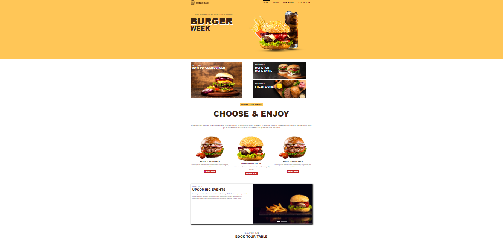

<h1 align="center"> Burger House </h1>

Burger website

  <a href="#-tecnologias">Tecnologias</a>&nbsp;&nbsp;&nbsp;|&nbsp;&nbsp;&nbsp;
  <a href="#-projeto">Projeto</a>&nbsp;&nbsp;&nbsp;|&nbsp;&nbsp;&nbsp;
  <a href="#memo-licença">Licença</a>

  

 

  

## 🚀 Tecnologias

Esse projeto foi desenvolvido com as seguintes tecnologias:

- BOOTSTRAP 5
- HTML e CSS

## 💻 Projeto

Complete food website project running bootstrap 5 framework.

## :memo: Licença

Esse projeto está sob a licença MIT.

---

 Desenvolvido por ME